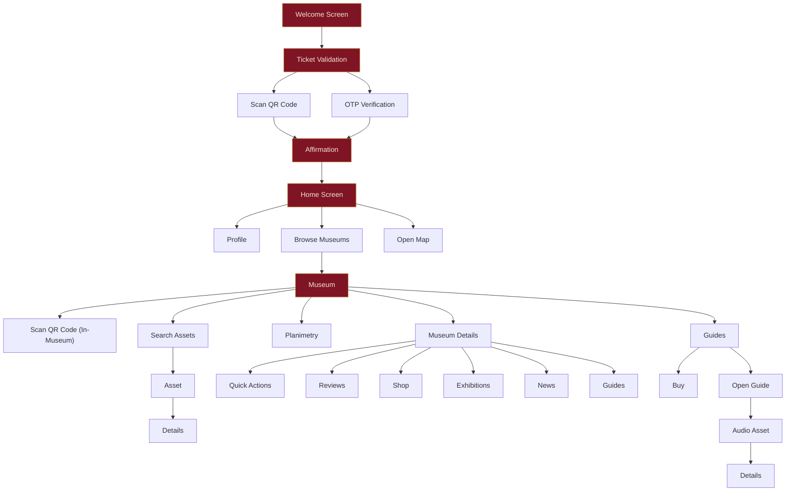

# Museum App — Onboarding & Design System

> A design specification for the ticket-first onboarding experience of a cultural heritage museum application. Traditional account creation is replaced by seamless ticket validation, reducing friction for users who have already purchased entry.

---

## 1. Design Philosophy

The application serves visitors of a cultural museum. Because every user has **already purchased a ticket**, we eliminate the conventional Sign Up / Log In paradigm entirely. Instead, the entry point is **ticket validation** — a single, elegant step that simultaneously authenticates the user and grants full application access.

> [!IMPORTANT]
> There is **no account creation screen**. The ticket _is_ the credential. This is the core UX differentiator.

### Guiding Principles

| Principle | Description |
|---|---|
| **Frictionless Entry** | One action (scan or OTP) unlocks the entire experience. |
| **Museum-Grade Aesthetics** | Every screen must feel like a curated gallery — warm, refined, intentional. |
| **Confidence & Clarity** | The user should never wonder "did it work?" — affirmation states are immediate and unmistakable. |
| **Accessibility First** | Two parallel validation methods ensure access regardless of device capability or user preference. |

---

## 2. Revised User Flow

The onboarding flow replaces the original Log In / Sign Up branch with a unified **Ticket Validation** step.



> [!NOTE]
> The "Forgot Password" and "Account Setup" nodes from the original flow are **removed**. The "Sign Up" and "Log In" branches are **merged** into a single "Ticket Validation" node.

---

## 3. Screen Specifications

### 3.1 — Welcome Screen

The launch screen that sets the emotional tone of the museum experience.

| Property | Specification |
|---|---|
| **Purpose** | Brand introduction, emotional priming, single CTA to proceed |
| **Background** | Full-bleed hero image or looping ambient video of the museum interior, overlaid with a subtle dark gradient (bottom → top) |
| **Logo** | Centered museum logotype, rendered in **Cormorant Bold** at 32pt, color `Parchment (#F0E6D2)` |
| **Tagline** | One-line museum tagline beneath the logo in **Open Sans Light** at 14pt, color `White (#FFFFFF)` at 70% opacity |
| **CTA Button** | "Validate Your Ticket" — pill-shaped, filled with `Adwa Gold (#C08A2E)`, text in **Open Sans SemiBold** 16pt `Dark Gray (#383838)` |
| **Animation** | Fade-in sequence: background (0ms) → logo (400ms) → tagline (700ms) → CTA (1000ms). CTA has a subtle pulsing glow (`#C08A2E` at 20% opacity, 2s cycle). |
| **Auto-advance** | None. User must tap the CTA. |

#### Layout Sketch

```
┌─────────────────────────────┐
│                             │
│     (ambient background)    │
│                             │
│                             │
│        ┌───────────┐        │
│        │   LOGO    │        │
│        └───────────┘        │
│      "Journey through       │
│        living history"      │
│                             │
│                             │
│   ┌───────────────────────┐ │
│   │  Validate Your Ticket │ │
│   └───────────────────────┘ │
│                             │
└─────────────────────────────┘
```

---

### 3.2 — Ticket Validation (Login Replacement)

The single authentication screen. Two parallel methods are presented as equal-weight tabs or toggle segments.

| Property | Specification |
|---|---|
| **Purpose** | Authenticate the user via their pre-purchased ticket |
| **Background** | Solid `Dark Gray (#383838)` with subtle radial gradient center glow of `Ember Red (#8C3B3B)` at 5% opacity |
| **Header** | "Validate Your Entry" in **Cormorant SemiBold** 28pt, `Parchment (#F0E6D2)` |
| **Subtitle** | "Use the ticket you received at purchase" in **Open Sans Regular** 14pt, `White (#FFFFFF)` at 60% opacity |
| **Method Toggle** | Segmented control with two options: `Scan QR` and `Enter OTP`. Active segment uses `Adwa Gold (#C08A2E)` fill with `Dark Gray (#383838)` text. Inactive segment is transparent with `White (#FFFFFF)` text and a 1px `White` border at 30% opacity. |

#### 3.2a — Scan QR Code Tab

| Property | Specification |
|---|---|
| **Camera Viewfinder** | Rounded rectangle (16px radius) centered in the content area, 280×280pt. Border: 2px solid `Adwa Gold (#C08A2E)`. Corner accents: thicker L-shaped brackets at each corner in `Adwa Gold`. |
| **Scanning State** | Animated scan line (horizontal, top→bottom loop) in `Adwa Gold` at 60% opacity, 2s cycle |
| **Helper Text** | "Point your camera at the QR code on your ticket" in **Open Sans Regular** 13pt, `White (#FFFFFF)` at 50% opacity, centered below viewfinder |
| **Permissions** | If camera access is denied, show a centered icon (camera-off) with "Camera access is required to scan your ticket" and a "Grant Access" button styled identically to the Welcome CTA |
| **Success** | Viewfinder border transitions to `Adwa Gold` at full opacity with a brief scale-pulse (1.02×, 200ms). Haptic feedback (medium). Auto-navigates to Affirmation after 600ms. |
| **Failure** | Viewfinder border flashes `Deep Red (#7F1425)` twice (200ms on/off). Toast notification: "Invalid ticket. Please try again." in **Open Sans Medium** 14pt on a `Deep Red` background pill. |

#### Layout Sketch — QR Tab

```
┌─────────────────────────────┐
│                             │
│    "Validate Your Entry"    │
│    "Use the ticket you      │
│     received at purchase"   │
│                             │
│   ┌──────────┬──────────┐   │
│   │ Scan QR  │ Enter OTP│   │
│   └──────────┴──────────┘   │
│                             │
│      ┌─ ─ ─ ─ ─ ─ ─┐      │
│      │               │      │
│      │   CAMERA      │      │
│      │   VIEWFINDER  │      │
│      │               │      │
│      └─ ─ ─ ─ ─ ─ ─┘      │
│                             │
│   "Point your camera at     │
│    the QR code"             │
│                             │
└─────────────────────────────┘
```

#### 3.2b — OTP Verification Tab

| Property | Specification |
|---|---|
| **Phone Input** | Text field with country code prefix, underline style, `White (#FFFFFF)` text on transparent background. Underline color: `White` at 30% idle, `Adwa Gold (#C08A2E)` on focus. Placeholder: "Registered mobile number" in **Open Sans Regular** 14pt at 30% opacity. |
| **Send OTP Button** | Text-only link style: "Send Code" in **Open Sans SemiBold** 14pt, `Adwa Gold (#C08A2E)`. Disabled state: same text at 30% opacity. Cooldown: 60s with countdown displayed. |
| **OTP Input** | 6-digit segmented input (individual boxes, 48×56pt each, 8px gap). Border: 1px solid `White (#FFFFFF)` at 30%. Active digit border: 2px solid `Adwa Gold (#C08A2E)`. Filled digit: **Open Sans SemiBold** 24pt `Parchment (#F0E6D2)`. |
| **Auto-submit** | OTP auto-submits when all 6 digits are entered. |
| **Resend** | "Didn't receive a code? Resend" — link text in **Open Sans Regular** 13pt, `White` at 50%, with "Resend" in `Adwa Gold`. Available after 60s cooldown. |
| **Success/Failure** | Same behavior as QR tab (border color transitions + haptic + navigation). |

#### Layout Sketch — OTP Tab

```
┌─────────────────────────────┐
│                             │
│    "Validate Your Entry"    │
│    "Use the ticket you      │
│     received at purchase"   │
│                             │
│   ┌──────────┬──────────┐   │
│   │ Scan QR  │ Enter OTP│   │
│   └──────────┴──────────┘   │
│                             │
│   +91 ____________________  │
│       Registered mobile no. │
│                             │
│              [Send Code]    │
│                             │
│   ┌──┐ ┌──┐ ┌──┐ ┌──┐      │
│   │  │ │  │ │  │ │  │ ...  │
│   └──┘ └──┘ └──┘ └──┘      │
│                             │
│   "Didn't receive a code?   │
│    Resend"                  │
│                             │
└─────────────────────────────┘
```

---

### 3.3 — Affirmation Screen

A brief, celebratory interstitial that confirms successful validation before routing to the Home Screen.

| Property | Specification |
|---|---|
| **Purpose** | Confirm valid entry, build excitement, transition to the main app |
| **Duration** | Auto-advances to Home Screen after **2.5 seconds** (with a subtle progress indicator) |
| **Background** | `Dark Gray (#383838)` with a radial burst of `Adwa Gold (#C08A2E)` particles emanating from center (Lottie animation or CSS keyframes) |
| **Icon** | Animated checkmark drawn in `Adwa Gold (#C08A2E)`, 64pt, stroke-dashoffset animation (0.6s ease-out) |
| **Primary Text** | "Welcome to the Museum" in **Cormorant Bold** 32pt, `Parchment (#F0E6D2)`, fade-in at 400ms |
| **Secondary Text** | "Your journey begins now" in **Open Sans Light** 16pt, `White (#FFFFFF)` at 70%, fade-in at 700ms |
| **Haptic** | Success haptic pattern on entry |
| **Skip** | Tapping anywhere on the screen immediately navigates to Home Screen |

#### Layout Sketch

```
┌─────────────────────────────┐
│                             │
│                             │
│                             │
│           ╭─────╮           │
│           │  ✓  │           │
│           ╰─────╯           │
│                             │
│    "Welcome to the Museum"  │
│   "Your journey begins now" │
│                             │
│                             │
│        ───────── (progress) │
│                             │
└─────────────────────────────┘
```

---

## 4. Typography System

Two typeface families compose the entire typographic hierarchy.

### Font Families

| Role | Typeface | Weight Variants Used | Usage |
|---|---|---|---|
| **Primary (Display)** | **Cormorant** | Regular 400, SemiBold 600, Bold 700 | App headings, screen titles, hero text, museum names. Evokes classical elegance. |
| **Secondary (UI)** | **Open Sans** | Light 300, Regular 400, Medium 500, SemiBold 600 | Body text, labels, buttons, footer navigation, form inputs. Optimized for legibility at small sizes. |

### Type Scale

| Token | Font | Weight | Size | Line Height | Letter Spacing | Usage |
|---|---|---|---|---|---|---|
| `heading-hero` | Cormorant | Bold 700 | 36pt | 1.2 | -0.5px | Welcome screen title |
| `heading-screen` | Cormorant | SemiBold 600 | 28pt | 1.25 | -0.3px | Screen titles (Validate, Affirmation) |
| `heading-section` | Cormorant | SemiBold 600 | 22pt | 1.3 | 0 | Section headers within screens |
| `heading-card` | Cormorant | Regular 400 | 18pt | 1.35 | 0 | Card titles, museum names |
| `body-primary` | Open Sans | Regular 400 | 16pt | 1.5 | 0 | Primary body text, descriptions |
| `body-secondary` | Open Sans | Regular 400 | 14pt | 1.45 | 0 | Secondary text, subtitles |
| `label-button` | Open Sans | SemiBold 600 | 16pt | 1.0 | 0.5px | Button labels |
| `label-input` | Open Sans | Regular 400 | 14pt | 1.0 | 0 | Form field text |
| `label-caption` | Open Sans | Light 300 | 13pt | 1.4 | 0.2px | Captions, helper text |
| `label-footer` | Open Sans | Medium 500 | 11pt | 1.0 | 0.3px | Footer navigation labels |
| `label-overline` | Open Sans | SemiBold 600 | 10pt | 1.0 | 1.5px | Overline labels (uppercase) |

> [!CAUTION]
> **Never** use Cormorant below 18pt. At small sizes, its high contrast and fine serifs collapse into illegibility. All UI utility text (labels, captions, footers, inputs) must use **Open Sans**.

---

## 5. Color Palette

### Core Palette

| Swatch | Name | Hex | RGB | Role |
|---|---|---|---|---|
| 🟡 | **Adwa Gold** | `#C08A2E` | 192, 138, 46 | Primary accent — interactive elements, play buttons, stop numbers, audio progress, active highlights, CTAs |
| 🔴 | **Deep Red** | `#7F1425` | 127, 20, 37 | Secondary accent — active navigation state, error states, brand emphasis |
| 🟤 | **Ember Red/Purple** | `#8C3B3B` | 140, 59, 59 | Tertiary — inactive/upcoming card backgrounds, warm depth layers |
| ⬛ | **Dark Gray** | `#383838` | 56, 56, 56 | Primary background — footer base, screen backgrounds, dark surfaces |
| 🟫 | **Parchment** | `#F0E6D2` | 240, 230, 210 | Primary surface — active cards, main titles, high-contrast readable surfaces |
| ⬜ | **White** | `#FFFFFF` | 255, 255, 255 | Text on dark, inactive icons, high-contrast elements |

### Extended Palette (Derived)

| Name | Hex | Derivation | Usage |
|---|---|---|---|
| Gold Glow | `#C08A2E` at 20% opacity | Adwa Gold | Button glow, focus rings, ambient highlights |
| Dark Overlay | `#383838` at 80% opacity | Dark Gray | Image overlays, modal backdrops |
| Parchment Muted | `#F0E6D2` at 60% opacity | Parchment | Disabled text on dark, placeholder text |
| Ember Subtle | `#8C3B3B` at 10% opacity | Ember Red | Background tints, hover states on light surfaces |

### Semantic Color Mapping

```
┌──────────────────────────────────────────────────────────────┐
│  CONTEXT           │  FOREGROUND       │  BACKGROUND         │
├──────────────────────────────────────────────────────────────┤
│  Screen Background │  —                │  #383838 Dark Gray  │
│  Active Card       │  #383838 text     │  #F0E6D2 Parchment │
│  Inactive Card     │  #F0E6D2 text     │  #8C3B3B Ember     │
│  CTA Button        │  #383838 text     │  #C08A2E Gold      │
│  Footer (base)     │  —                │  #383838 Dark Gray  │
│  Footer (inactive) │  #FFFFFF icons    │  —                  │
│  Footer (active)   │  #7F1425 or Gold  │  —                  │
│  Error State       │  #FFFFFF text     │  #7F1425 Deep Red   │
│  Success State     │  #C08A2E icon     │  #383838 Dark Gray  │
└──────────────────────────────────────────────────────────────┘
```

---

## 6. Footer Navigation Bar

The persistent bottom navigation bar anchoring the application.

### Structure

```
┌─────────────────────────────────────────────────┐
│                 #383838 Background              │
│                                                 │
│   🏠        🗺️        📷        👤        ≡    │
│  Home      Map      Scan    Profile    More     │
│                                                 │
└─────────────────────────────────────────────────┘
```

### Footer Specifications

| Property | Specification |
|---|---|
| **Height** | 64pt (+ safe area inset on notched devices) |
| **Background** | `Dark Gray (#383838)`, solid fill. Optional: 1px top border in `White (#FFFFFF)` at 8% opacity for subtle separation. |
| **Icon Size** | 24×24pt, outlined style (not filled), 1.5px stroke |
| **Label Font** | **Open Sans Medium** 500, 11pt, 0.3px letter-spacing |
| **Inactive State** | Icon stroke + label color: `White (#FFFFFF)` |
| **Active State** | Icon stroke + label color: `Deep Red (#7F1425)` **or** `Adwa Gold (#C08A2E)` — choose one per deployment and remain consistent. An optional 4px-wide indicator dot or bar in the active color sits above the icon. |
| **Tap Target** | Minimum 48×48pt per item (accessibility compliance) |
| **Transition** | Color crossfade 200ms ease-in-out on tab switch |

> [!TIP]
> For the active state, **Adwa Gold** provides stronger visibility against the dark footer and aligns with the primary interactive accent. Use **Deep Red** if brand alignment with the museum's identity takes priority over contrast.

---

## 7. Card System

Cards are the primary content container across the Home Screen and Museum browsing flows.

### Active Card (Current / Featured)

| Property | Value |
|---|---|
| Background | `Parchment (#F0E6D2)` |
| Title text | **Cormorant SemiBold** 22pt, `Dark Gray (#383838)` |
| Body text | **Open Sans Regular** 14pt, `Dark Gray (#383838)` at 80% |
| Border radius | 16px |
| Shadow | `0 8px 24px rgba(0,0,0,0.25)` |
| Accent elements | `Adwa Gold (#C08A2E)` — play buttons, progress bars, stop numbers |

### Inactive Card (Upcoming / Queue)

| Property | Value |
|---|---|
| Background | `Ember Red/Purple (#8C3B3B)` |
| Title text | **Cormorant SemiBold** 18pt, `Parchment (#F0E6D2)` |
| Body text | **Open Sans Regular** 13pt, `Parchment (#F0E6D2)` at 70% |
| Border radius | 12px |
| Shadow | `0 4px 12px rgba(0,0,0,0.15)` |
| Scale | 0.95× compared to active card (visual hierarchy via size) |

---

## 8. Interaction & Motion Guidelines

| Interaction | Animation | Duration | Easing |
|---|---|---|---|
| Screen transition | Slide left + fade | 350ms | `cubic-bezier(0.4, 0, 0.2, 1)` |
| Modal / overlay | Fade in + slide up | 300ms | `ease-out` |
| Button press | Scale to 0.96× then release | 150ms | `ease-in-out` |
| Tab switch (footer) | Icon color crossfade | 200ms | `ease-in-out` |
| Card scroll snap | Horizontal scroll with momentum snap | 400ms | `cubic-bezier(0.25, 0.1, 0.25, 1)` |
| QR scan line | Vertical sweep (top→bottom loop) | 2000ms | `linear` |
| Affirmation checkmark | Stroke-dashoffset draw | 600ms | `ease-out` |
| Gold particle burst | Radial expansion + fade | 1500ms | `ease-out` |
| Success haptic | Medium impact | Instant | — |
| Error haptic | Double short | Instant | — |

---

## 9. Screen Inventory (Full Application)

A complete enumeration of all screens derived from the user flow, with the revised onboarding replacing the original auth branch.

| # | Screen | Parent | Description |
|---|---|---|---|
| 1 | Welcome Screen | — | Brand introduction, single CTA to validate ticket |
| 2 | Ticket Validation | Welcome | Tabbed interface: QR scan + OTP entry |
| 3 | Affirmation | Validation | Success confirmation, auto-advance to Home |
| 4 | Home Screen | Affirmation | Central hub — featured content, quick access |
| 5 | Profile | Home | User preferences, visit history, saved items |
| 6 | Browse Museums | Home | Scrollable museum directory |
| 7 | Open Map | Home | Interactive map with points of interest |
| 8 | Museum | Browse | Individual museum landing page |
| 9 | Scan QR Code | Museum | In-museum asset scanning (reuses camera component) |
| 10 | Search Assets | Museum | Text search within museum collection |
| 11 | Planimetry | Museum | Floor plan / spatial navigation |
| 12 | Museum Details | Museum | Extended museum info — tabs below |
| 13 | Guides | Museum | Audio/multimedia guide listings |
| 14 | Asset | Search | Individual asset view |
| 15 | Asset Details | Asset | Full asset information, media, description |
| 16 | Quick Actions | Museum Details | Shortcuts (directions, share, save) |
| 17 | Reviews | Museum Details | User reviews and ratings |
| 18 | Shop | Museum Details | Museum gift shop / e-commerce |
| 19 | Exhibitions | Museum Details | Current and upcoming exhibitions |
| 20 | News | Museum Details | Museum news feed |
| 21 | Museum Guides | Museum Details | Guides scoped to this museum |
| 22 | Buy Guide | Guides | Purchase flow for premium guides |
| 23 | Open Guide | Guides | Guide player / reader |
| 24 | Audio Asset | Open Guide | Audio playback with progress (Gold accents) |
| 25 | Audio Details | Audio Asset | Track info, transcript, related stops |

---

## 10. Accessibility Requirements

| Requirement | Standard | Implementation |
|---|---|---|
| Color contrast | WCAG 2.1 AA (4.5:1 for text, 3:1 for large text) | All text/background combinations verified: `#F0E6D2` on `#383838` = **9.2:1** ✅, `#FFFFFF` on `#383838` = **9.6:1** ✅, `#383838` on `#C08A2E` = **3.4:1** ✅ (large text only) |
| Touch targets | 48×48pt minimum | All interactive elements meet or exceed |
| Screen reader | Full VoiceOver / TalkBack support | All images have alt text, all buttons have aria-labels |
| Reduced motion | `prefers-reduced-motion` respected | All animations disabled or simplified |
| Font scaling | Up to 200% system font size | Layouts flex via relative units (rem/em) |

---

## 11. Asset Requirements

| Asset | Format | Notes |
|---|---|---|
| Welcome background | JPEG/WebP + MP4 (optional ambient video) | 1080×1920 minimum, optimized for mobile |
| Museum logo | SVG (vector) | Monochrome variant for dark backgrounds |
| Checkmark animation | Lottie JSON or CSS keyframes | Gold (#C08A2E) stroke on transparent |
| QR scan line | CSS animation or Lottie | Horizontal sweep in Gold |
| Footer icons | SVG, 24×24pt, 1.5px stroke | Home, Map, Scan, Profile, More |
| Card imagery | WebP with fallback JPEG | Lazy-loaded, placeholder blur-up |

---

> [!NOTE]
> This document covers the **onboarding flow** (Screens 1–3) and the **global design system** (typography, color, footer, cards, motion). Individual screen designs for Screens 4–25 should reference the tokens and patterns defined here as the single source of truth.
